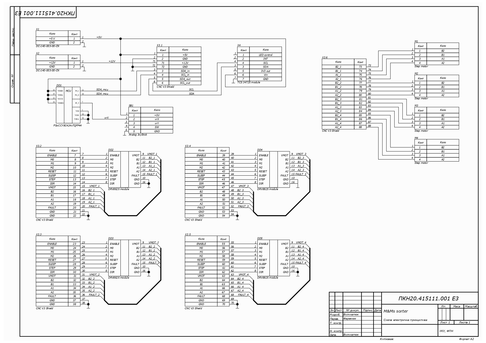

# M&Ms sorter

M&Ms sorter is a device to sort candies that look loke M&Ms. It can use default colours for sorting or "learn" new ones at the beginning of the sorting process.

## Description

M&Ms sorter consists of a color sensor, stepper motors, drivers and a shield for them, joystick and the microcontroller PSoC4.

The sorting process looks like this:
1. Spinning container analyzes the candy's color and supplies it to the "tunnel".
2. From the "tunnel" a candy falls to the gates that lead to the needed container. 

Before sorting the user can set unique colors of sorting. For this:
1. The user should press the button and wait until the color sensor will finish to read "no color" state.
2. Then the user should fill container with candies of the first color and push the joystick-button. 
3. The container starts spinning and analyzing the colour cleaning all samples of "no color" state.
4. After "reading" enough samples of the first colour container stops spinning. It is ready to the next color.
5. This procedure should be repeated for all colors that the user wants to sort.
6. Then, with pushing a button, the user can turn on the sorting process.

With this sorting machine you can sort up to 5 colors with a container for incorrectly sorted candies or 6 colors without such a container.

## Wiring diagram

## PSoC creator scheme

